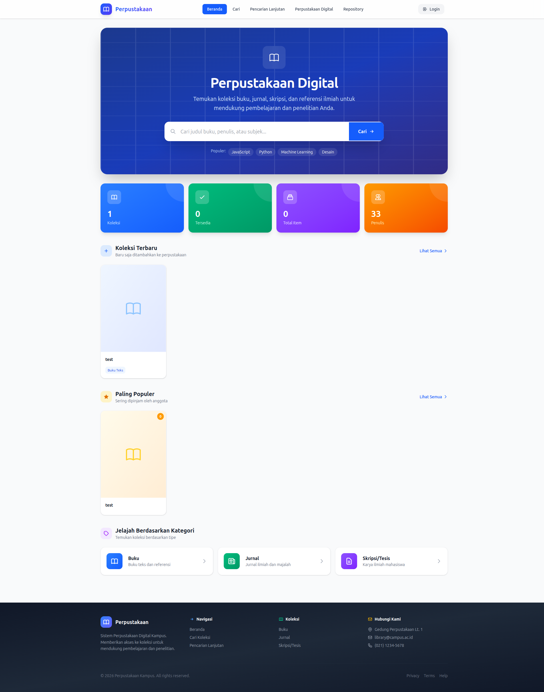
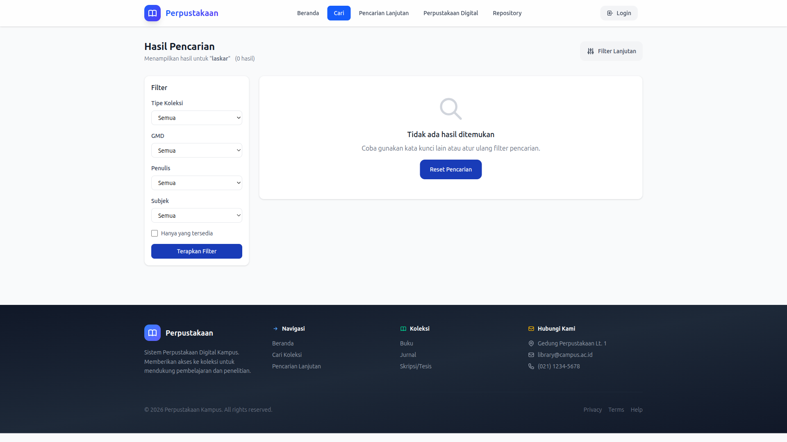
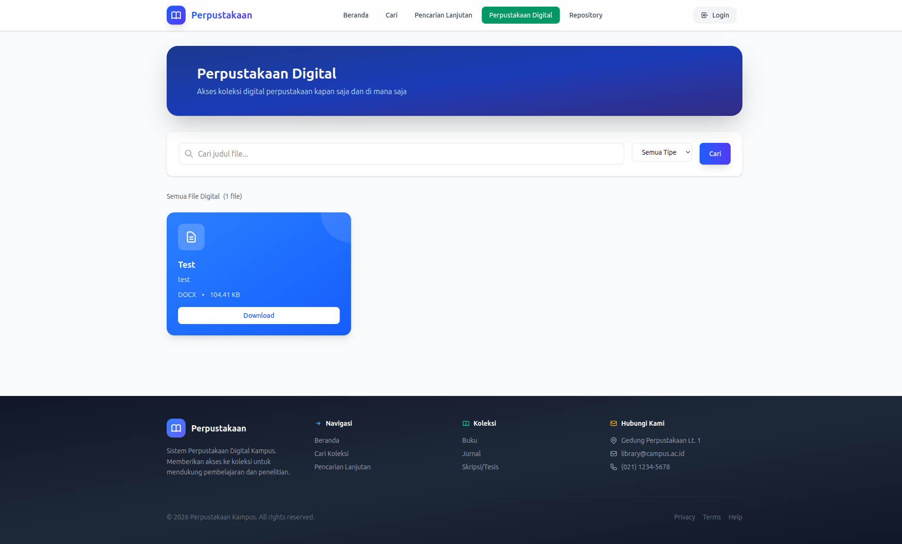
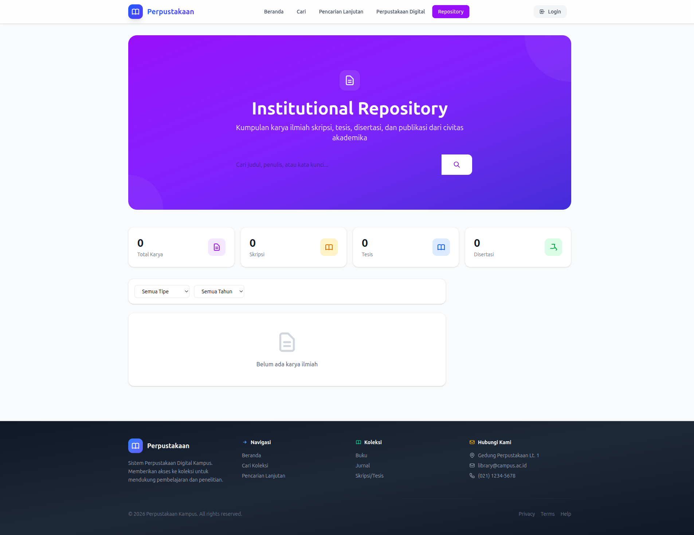
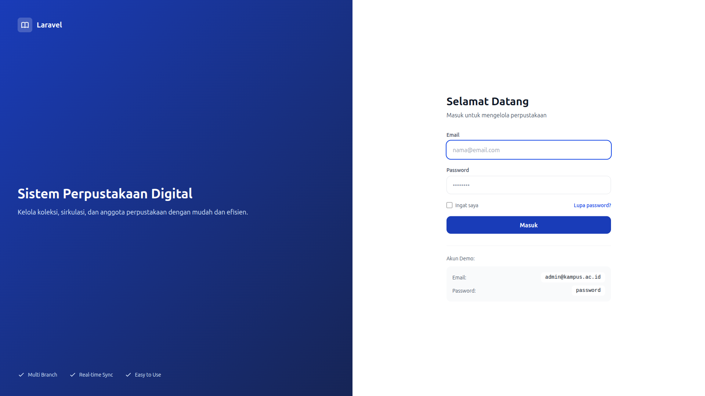

# PANDUAN PENGGUNAAN APLIKASI PERPUSTAKAAN
## Untuk Anggota Perpustakaan

---

## Daftar Isi

1. [Pendahuluan](#pendahuluan)
2. [Fitur Publik (Tanpa Login)](#fitur-publik-tanpa-login)
   - [OPAC - Pencarian Buku](#opac---pencarian-buku)
   - [Perpustakaan Digital](#perpustakaan-digital)
   - [Repository Institusi](#repository-institusi)
3. [Login & Registrasi](#login--registrasi)
4. [Dashboard](#dashboard)
5. [Peminjaman Saya](#peminjaman-saya)
6. [Reservasi Buku](#reservasi-buku)
7. [Perpustakaan Digital Member](#perpustakaan-digital-member)
8. [Profil Saya](#profil-saya)

---

---

## Pendahuluan

Selamat datang di **Aplikasi Perpustakaan Digital**!

Aplikasi ini memungkinkan Anda untuk:
- 🔍 Mencari dan menelusuri koleksi buku secara online
- 📚 Meminjam buku fisik dari perpustakaan
- 📝 Mereservasi buku yang sedang dipinjam
- 📊 Memantau riwayat peminjaman Anda
- 📁 Mengakses perpustakaan digital (e-book, jurnal)
- 📦 Mengakses repository institusi (skripsi, tesis)

---

---

## Fitur Publik (Tanpa Login)

### OPAC - Pencarian Buku

OPAC (Online Public Access Catalog) adalah katalog online untuk mencari koleksi buku tanpa perlu login.

#### Tampilan OPAC

#### Cara Mencari Buku

1. Buka halaman OPAC
2. Ketik judul, penulis, atau kata kunci di kotak pencarian
3. Klik tombol **Cari** atau tekan Enter

#### Hasil Pencarian

Hasil pencarian menampilkan:
- **Judul buku** - Judul lengkap buku
- **Penulis** - Nama penulis/pengarang
- **Penerbit** - Nama penerbit
- **Tahun** - Tahun terbit
- **Status** - Ketersediaan (Tersedia/Dipinjam)

#### Melihat Detail Buku

Klik pada judul buku untuk melihat informasi lengkap:
- Data bibliografis (judul, penulis, penerbit, tahun)
- Deskripsi fisik (jumlah halaman, ilustrasi)
- Ringkasan/Sinopsis
- Klasifikasi (nomor DDC, lokasi rak)
- Status ketersediaan

---

### Perpustakaan Digital

Perpustakaan Digital menyediakan akses ke koleksi digital seperti e-book, jurnal, skripsi, dan tesis.

#### Tampilan Perpustakaan Digital

#### Menelusuri Koleksi Digital

1. Buka halaman **Perpustakaan Digital**
2. Koleksi ditampilkan dalam bentuk grid
3. Gunakan **Filter** untuk menyaring:
   - Kategori
   - Tipe file
   - Tahun terbit

#### Membaca/Download File

1. Klik pada file yang diinginkan
2. Pilih opsi:
   - **Preview** - Baca langsung di browser
   - **Download** - Download ke perangkat Anda

---

### Repository Institusi

Repository menyimpan karya ilmiah mahasiswa, dosen, dan staf seperti skripsi, tesis, desertasi, dan jurnal.

#### Tampilan Repository

#### Mencari Dokumen

1. Buka halaman **Repository**
2. Ketik judul, penulis, atau kata kunci
3. Klik **Cari**

#### Mengakses Dokumen

1. Klik pada judul dokumen
2. Informasi lengkap ditampilkan:
   - Abstrak
   - Penulis
   - Pembimbing
   - Tahun
   - Kata kunci
3. Klik **Download** untuk mengunduh full text

---

---

## Login & Registrasi

### Halaman Login

### Cara Login

1. Buka halaman Login
2. Masukkan **Email** dan **Password**
3. Klik tombol **Masuk**

**Email:** Masukkan email yang terdaftar saat menjadi anggota
**Password:** Password yang Anda buat saat pendaftaran

### Lupa Password?

Jika lupa password:
1. Klik link **Lupa Password?**
2. Masukkan email Anda
3. Cek email untuk link reset password
4. Buat password baru
5. Login dengan password baru

---

---

## Dashboard

Setelah login, Anda akan diarahkan ke **Dashboard** yang menampilkan ringkasan aktivitas Anda.

#### Tampilan Dashboard

Dashboard memberikan informasi cepat:
- 📚 **Buku Dipinjam** - Jumlah buku yang sedang Anda pinjam
- 📅 **Jatuh Tempo** - Tanggal pengembalian paling dekat
- ⚠️ **Terlambat** - Jumlah buku yang terlambat (jika ada)
- 💰 **Denda** - Total denda yang harus dibayar (jika ada)

---

---

## Peminjaman Saya

Lihat daftar buku yang sedang dan pernah Anda pinjam.

### Mengakses Peminjaman Saya

1. Klik menu **Peminjaman** di sidebar
2. Daftar peminjaman ditampilkan dengan tab:
   - **Aktif** - Buku yang sedang dipinjam
   - **Riwayat** - Buku yang sudah dikembalikan

### Informasi Peminjaman Aktif

Untuk setiap buku yang dipinjam, Anda dapat melihat:
- 📖 **Judul Buku**
- 📅 **Tanggal Pinjam** - Saat Anda meminjam
- ⏰ **Jatuh Tempo** - Batas pengembalian
- 📍 **Lokasi** - Cabang perpustakaan
- 🔁 **Jumlah Perpanjangan** - Berapa kali sudah diperpanjang
- ⚠️ **Status** - Aktif / Terlambat

### Memperpanjang Peminjaman

Jika Anda butuh waktu lebih lama:

1. Buka halaman **Peminjaman**
2. Cari buku yang ingin diperpanjang
3. Klik tombol **Perpanjang**
4. Sistem akan menghitung tanggal jatuh tempo baru

**Syarat Perpanjangan:**
- Maksimal 2x perpanjangan
- Tidak ada anggota lain yang memesan buku tersebut
- Tidak terlambat mengembalikan

---

---

## Reservasi Buku

Reservasi adalah memesan buku yang sedang tidak tersedia (dipinjam orang lain).

### Membuat Reservasi

1. Cari buku yang ingin direservasi melalui OPAC
2. Pastikan status buku **"Dipinjam"** atau **"Tidak Tersedia"**
3. Klik tombol **Reservasi**
4. Atau melalui menu **Reservasi** → **Buat Reservasi Baru**
5. Sistem akan mengkonfirmasi reservasi Anda

### Melihat Reservasi Saya

1. Klik menu **Reservasi Saya**
2. Daftar reservasi ditampilkan dengan status:
   - 🟡 **Menunggu** - Masih dalam antrian
   - 🔵 **Tersedia** - Buku sudah kembali, siap diambil
   - ✅ **Selesai** - Sudah diambil
   - ❌ **Dibatalkan** - Reservasi dibatalkan

### Membatalkan Reservasi

Jika Anda tidak lagi membutuhkan buku:

1. Buka **Reservasi Saya**
2. Cari reservasi yang ingin dibatalkan
3. Klik tombol **Batalkan**
4. Konfirmasi pembatalan

### Mengambil Buku yang Di-reservasi

1. Cek status reservasi (harus **"Tersedia"**)
2. Datang ke perpustakaan
3. Tunjukkan kartu anggota
4. Ambil buku di loket pelayanan

> **Batas Waktu:** 3 hari sejak status berubah "Tersedia". Jika tidak diambil, reservasi otomatis dibatalkan.

---

---

## Perpustakaan Digital Member

Setelah login, Anda memiliki akses penuh ke Perpustakaan Digital.

### Fitur Tambahan untuk Member

- **Download Unlimited** - Download tanpa batasan
- **Bookmark** - Simpan file ke favorit
- **Riwayat Download** - Lihat file yang pernah didownload

### Mencari File Digital

1. Klik menu **Perpustakaan Digital**
2. Gunakan pencarian cepat
3. Atur filter sesuai kebutuhan
4. Klik file untuk melihat detail

---

---

## Profil Saya

Kelola informasi profil dan akun Anda.

### Mengedit Profil

1. Klik foto profil di pojok kanan atas
2. Klik **Profil**
3. Klik **Edit Profil**
4. Update informasi:
   - Nama Lengkap
   - Email
   - Nomor Telepon
   - Alamat
5. Klik **Simpan**

### Mengubah Password

1. Buka halaman **Profil**
2. Scroll ke bagian **Password**
3. Masukkan:
   - Password Lama
   - Password Baru
   - Konfirmasi Password Baru
4. Klik **Simpan**

> **Tips:** Gunakan password yang kuat dengan kombinasi huruf, angka, dan simbol.

---

---

## FAQ - Pertanyaan Umum

### Tentang Peminjaman

**Q: Berapa lama masa peminjaman?**
A:
- Mahasiswa: 7 hari
- Dosen: 14 hari
- Staf: 7 hari

**Q: Berapa banyak buku yang bisa dipinjam?**
A:
- Mahasiswa: 3 buku
- Dosen: 5 buku
- Staf: 3 buku

**Q: Apakah ada denda keterlambatan?**
A: Ya, Rp 1.000 per hari per buku, termasuk hari libur.

### Tentang Reservasi

**Q: Berapa lama saya harus menunggu?**
A: Tergantung peminjam sebelumnya. Biasanya 7-14 hari. Anda akan mendapatkan notifikasi saat buku tersedia.

**Q: Apakah reservasi dikenakan biaya?**
A: Tidak, reservasi gratis.

### Tentang Perpustakaan Digital

**Q: Apakah semua e-book gratis?**
A: Ya, semua e-book di perpustakaan digital dapat diakses gratis untuk anggota.

---

---

## Bantuan & Kontak

**Perlu bantuan lebih lanjut?**

📍 **Lokasi:**
Perpustakaan Tazkia
Jl. Raya Tegal No. 123, Ponorogo

📧 **Email:**
library@tazkia.ac.id

📞 **Telepon:**
(0352) 1234567

💬 **WhatsApp:**
0812-3456-7890

⏰ **Jam Operasional:**
- Senin - Jumat: 08.00 - 16.00 WIB
- Sabtu: 08.00 - 12.00 WIB
- Minggu & Libur Nasional: Tutup

---

---

*Terakhir diperbarui: 2 Februari 2026*
*Versi: 1.0*

---

© 2026 Perpustakaan Tazkia. All rights reserved.
